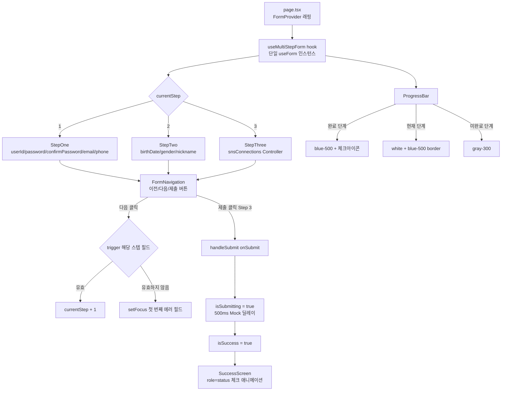

# Blueprint: 3단계 멀티스텝 회원가입 폼

## 1. 핵심 목적

포트폴리오 데모 페이지(`/practices/form-page`)로서, React Hook Form + Zod + TypeScript를 활용한
3단계 멀티스텝 회원가입 폼을 구현한다. 실제 API 연동 없이 Mock submit으로 UX 흐름 전체를 시연하며,
**단일 `useForm` 인스턴스**(`shouldUnregister: false`)로 전 단계 필드를 관리하는 아키텍처를 증명한다.

---

## 2. 시스템 스코프

### In Scope

| 항목 | 설명 |
|------|------|
| 3단계 스텝 폼 | Step 1(계정), Step 2(프로필), Step 3(SNS 연결) |
| 단일 useForm 관리 | `shouldUnregister: false`로 전 단계 필드 유지, 페이지 이동 시 데이터 보존 |
| 클라이언트 유효성 검증 | Zod schema + RHF `trigger()`, onBlur 모드 |
| 반응형 레이아웃 | Tailwind CSS 4, 모바일 우선 |
| Mock Submit | 500ms 딜레이 후 성공 화면 전환 |
| 접근성 | ARIA 속성(`aria-invalid`, `aria-describedby`, `role="alert"`), focus 관리, `fieldset+legend` |
| 성공 화면 | 닉네임 개인화, 이메일, 연결 SNS 요약, "포트폴리오 둘러보기" CTA |

### Out of Scope

| 항목 | 이유 |
|------|------|
| 실제 API / 서버 액션 | 포트폴리오 데모 목적 |
| OAuth / 실제 SNS 연동 | Mock UI(토글)로 대체 |
| 이메일 인증 | 범위 외 |
| 아이디/이메일 중복 확인 | 서버 의존성 제거 |
| URL 파라미터 기반 직접 접근 | 순차 진행만 허용 |
| 데이터 영속성 (sessionStorage 등) | 페이지 리로드 시 초기화 |

---

## 3. 핵심 컴포넌트 테이블

| 컴포넌트 | 파일 경로 | 역할 |
|----------|-----------|------|
| `Page` | `form-page/page.tsx` | 라우트 엔트리, FormProvider 감싸기, isSuccess 분기 |
| `useMultiStepForm` | `_hooks/useMultiStepForm.ts` | 단일 useForm 인스턴스, 스텝 제어, trigger, submit 핸들러 |
| `signupSchema` | `_schemas/signupSchema.ts` | 전체 Zod 스키마 (superRefine 포함), 타입 export |
| `ProgressBar` | `_components/ProgressBar.tsx` | 현재 스텝 시각화 (완료/현재/미완료 상태) |
| `StepOne` | `_components/steps/StepOne.tsx` | userId, password, confirmPassword, email, phone |
| `StepTwo` | `_components/steps/StepTwo.tsx` | birthDate, gender, nickname |
| `StepThree` | `_components/steps/StepThree.tsx` | snsConnections (google, github, kakao) RHF Controller 토글 |
| `FormNavigation` | `_components/FormNavigation.tsx` | 이전/다음/제출 버튼 + 로딩 상태 |
| `SuccessScreen` | `_components/SuccessScreen.tsx` | 완료 화면, 닉네임/이메일/SNS 요약, CTA |

---

## 4. 고수준 데이터 흐름



---

## 5. 핵심 통합 포인트

### 5.1 단일 useForm 인스턴스 전파

```
page.tsx
  └── <FormProvider {...methods}>
        ├── StepOne    → useFormContext()
        ├── StepTwo    → useFormContext()
        └── StepThree  → useFormContext() + Controller
```

`useMultiStepForm` 훅이 `useForm<SignupFormValues>({ shouldUnregister: false, mode: 'onBlur' })`를 생성하고,
반환된 `methods`를 `FormProvider`에 주입하여 하위 컴포넌트가 `useFormContext()`로 접근한다.

### 5.2 스텝 필드 그룹 매핑

```typescript
const STEP_FIELDS: Record<number, (keyof SignupFormValues)[]> = {
  1: ['userId', 'password', 'confirmPassword', 'email', 'phone'],
  2: ['birthDate', 'gender', 'nickname'],
  3: ['snsConnections'],
}
```

`handleNext()` 호출 시 해당 스텝 필드만 `trigger(STEP_FIELDS[currentStep])`하여 검증 후 진행.
검증 실패 시 `setFocus(첫 번째 에러 필드)`로 포커스 이동.

### 5.3 전화번호 포매터

`onChange` 핸들러에서 숫자만 추출 후 `010-XXXX-XXXX` 패턴으로 하이픈 자동 삽입.
RHF `register`의 `onChange`를 래핑하여 formatted 값을 `setValue`로 주입.

### 5.4 confirmPassword 연동 (BA EC-04)

`password` 필드 `onChange` 시 `trigger('confirmPassword')` 호출하여 실시간 재검증.
`getFieldState('confirmPassword').isDirty`가 true일 때만 재검증하여 UX 저해 방지.

### 5.5 birthDate superRefine

Zod `superRefine`으로 세 가지 교차 검증:
1. 월별 최대 일수 초과 여부 (1월=31, 4월=30 등)
2. 윤년 2월 29일 유효성
3. 미래 날짜 불가

### 5.6 SNS 상태 RHF 내 관리 (BA EC-07)

`snsConnections: { google: boolean, github: boolean, kakao: boolean }` 을 RHF 스키마에 포함하여
외부 `useState` 사용 금지. `Controller`로 각 토글 연결.

### 5.7 Mock Submit 흐름

```
handleSubmit(onSubmit)
  → isSubmitting = true  (RHF 자동 관리)
  → await new Promise(resolve => setTimeout(resolve, 500))
  → setIsSuccess(true)
  → SuccessScreen 렌더링
```

---

## 6. 파일 구조

```
src/app/practices/form-page/
├── page.tsx                          # 라우트 엔트리, FormProvider, isSuccess 분기
├── _schemas/
│   └── signupSchema.ts              # Zod 전체 스키마 + 타입
├── _hooks/
│   └── useMultiStepForm.ts         # 단일 useForm, 스텝 제어, trigger
├── _components/
│   ├── steps/
│   │   ├── StepOne.tsx
│   │   ├── StepTwo.tsx
│   │   └── StepThree.tsx
│   ├── ProgressBar.tsx
│   ├── FormNavigation.tsx
│   └── SuccessScreen.tsx
└── _docs/
    └── spec/
        ├── blueprint.md       ← 현재 파일
        ├── requirements.md
        ├── design.md
        ├── tasks.md
        └── validation.md
```

## 7. ui

Shadcn을 사용 함.